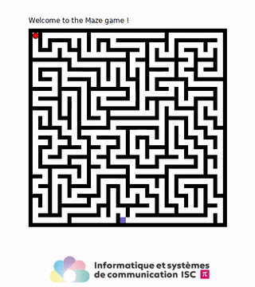

# `A*` pathfinding project

[![CC BY-NC-SA 4.0][cc-by-nc-sa-shield]][cc-by-nc-sa]

## Content
This projet file is a skeleton for implementing the short version of the Maze pathfinding using the `A*` algorithm application in Java.

## Project description and tasks to do
The project is not complete and is intented to be completed in a live coding session. The full project instructions, in French, is available [as a PDF](https://github.com/pmudry/maze-students/blob/main/ProjetMaze_short.pdf) file with clickable links.

## Audience
This bot is targeted at students with an existing background in programming, mainly in Java. It was made to demonstrate the algorithmic approach of solving a problem which is taught in the [*Computer science and communication* bachelor's degree at the School of engineering in Sion, Switzerland](https://www.hevs.ch/isc).

  

Enjoy and have fun programming 🎈 !

_Pierre-André Mudry_, February 2023

## License
This work is licensed under a
[Creative Commons Attribution-NonCommercial-ShareAlike 4.0 International License][cc-by-nc-sa].

[![CC BY-NC-SA 4.0][cc-by-nc-sa-image]][cc-by-nc-sa]

[cc-by-nc-sa]: http://creativecommons.org/licenses/by-nc-sa/4.0/
[cc-by-nc-sa-image]: https://licensebuttons.net/l/by-nc-sa/4.0/88x31.png
[cc-by-nc-sa-shield]: https://img.shields.io/badge/License-CC%20BY--NC--SA%204.0-lightgrey.svg
